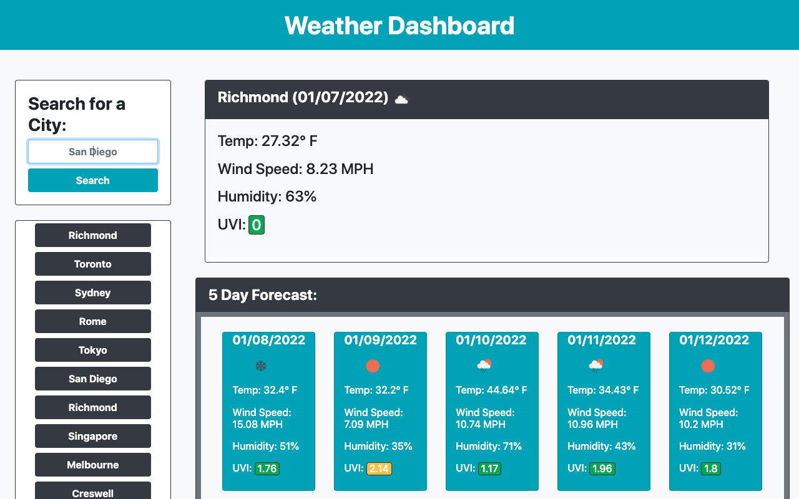

# weather-dashboard

## In this project I...
### 1) Created an index.html file to hold the content of my page.
### 2) Used the Bootstrap library to style my page.
### 3) Wrote my own custom JavaScript, linked to OpenWeatherMap's API, which altogether allows users to...
* input a city to search for its current and forecasted (for the next five days) weather conditions.
* have a city's current and future weather conditions displayed in a manner organized cleanly by date (also displayed) on the webpage.
* click on buttons representing cities they've searched for just now or earlier to see those cities' weather conditions again.

[Link to Deployed Application](https://sora64.github.io/phelps-weather-dashboard-challenge/)

